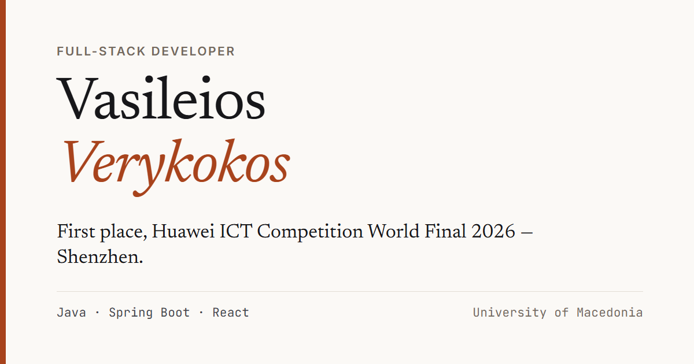

# Personal site — Vasileios Verykokos

A single-page site for **Vasileios Verykokos**, full-stack developer.

---

## What it is for

This site has one job: get me an interview.

A recruiter gives a portfolio somewhere between ten and thirty seconds before
deciding whether to keep reading. More than half of them open it on a phone,
between meetings or on a train. So the site is built to answer three questions in
that window — what has he actually done, can he actually build things, and how do
I reach him — and to answer them on a 320px screen with no JavaScript.

The headline is first place at the **Huawei ICT Competition World Final 2026** in
Shenzhen. Behind it sit two case studies, each written around one paragraph called
*the hard part*: not what the project was, but the specific engineering problem I
had to solve and how I solved it. A wildfire spread model running client-side in a
browser. A signal engine built as a state machine so it fires on transitions instead
of crying wolf every day.

**The repository is part of the portfolio.** If you are evaluating me as an
engineer, the code here is meant to be read — that is why the commit history is
one commit per phase.

---

Built by Vasileios Verykokos · [verykokosvasileios@gmail.com](mailto:verykokosvasileios@gmail.com)
